1: Data Formatting and Clustering
================
Jacob C. Cooper

# Introduction

## Biogeography and Ecology of the genus *Progne*

The genus *Progne* (aka, Western Hemisphere Martins) are a group of
large swallows found through North and South America, including on
islands within the Caribbean and the Galapagos. The purpose of this
study is to determine 1) if niche diversification is occurring within
the genus and 2) if the birds are saturating the geographic scope of
their niche within their geographic distribution.

More information on the populations can be found in the `readme` file.

## Required Packages

``` r
library(data.table)
library(factoextra)
```

    ## Loading required package: ggplot2

    ## Welcome! Want to learn more? See two factoextra-related books at https://goo.gl/ve3WBa

``` r
library(fitdistrplus)
```

    ## Loading required package: MASS

    ## Loading required package: survival

``` r
library(fossil)
```

    ## Loading required package: sp

    ## The legacy packages maptools, rgdal, and rgeos, underpinning the sp package,
    ## which was just loaded, will retire in October 2023.
    ## Please refer to R-spatial evolution reports for details, especially
    ## https://r-spatial.org/r/2023/05/15/evolution4.html.
    ## It may be desirable to make the sf package available;
    ## package maintainers should consider adding sf to Suggests:.
    ## The sp package is now running under evolution status 2
    ##      (status 2 uses the sf package in place of rgdal)

    ## Loading required package: maps

    ## Loading required package: shapefiles

    ## Loading required package: foreign

    ## 
    ## Attaching package: 'shapefiles'

    ## The following objects are masked from 'package:foreign':
    ## 
    ##     read.dbf, write.dbf

``` r
library(maptools)
```

    ## Please note that 'maptools' will be retired during October 2023,
    ## plan transition at your earliest convenience (see
    ## https://r-spatial.org/r/2023/05/15/evolution4.html and earlier blogs
    ## for guidance);some functionality will be moved to 'sp'.
    ##  Checking rgeos availability: TRUE

``` r
library(MASS)
library(nichevol)
```

    ## Loading required package: ape

``` r
library(raster)
```

    ## 
    ## Attaching package: 'raster'

    ## The following object is masked from 'package:MASS':
    ## 
    ##     select

``` r
library(rnaturalearth)
```

    ## Support for Spatial objects (`sp`) will be deprecated in {rnaturalearth} and will be removed in a future release of the package. Please use `sf` objects with {rnaturalearth}. For example: `ne_download(returnclass = 'sf')`

``` r
library(rnaturalearthhires)
library(rgdal)
```

    ## Please note that rgdal will be retired during October 2023,
    ## plan transition to sf/stars/terra functions using GDAL and PROJ
    ## at your earliest convenience.
    ## See https://r-spatial.org/r/2023/05/15/evolution4.html and https://github.com/r-spatial/evolution
    ## rgdal: version: 1.6-7, (SVN revision 1203)
    ## Geospatial Data Abstraction Library extensions to R successfully loaded
    ## Loaded GDAL runtime: GDAL 3.4.3, released 2022/04/22
    ## Path to GDAL shared files: /usr/share/gdal
    ## GDAL binary built with GEOS: TRUE 
    ## Loaded PROJ runtime: Rel. 8.2.1, January 1st, 2022, [PJ_VERSION: 821]
    ## Path to PROJ shared files: /home/jccooper/.local/share/proj:/usr/share/proj
    ## PROJ CDN enabled: TRUE
    ## Linking to sp version:2.0-0
    ## To mute warnings of possible GDAL/OSR exportToProj4() degradation,
    ## use options("rgdal_show_exportToProj4_warnings"="none") before loading sp or rgdal.

``` r
library(sf)
```

    ## Linking to GEOS 3.10.2, GDAL 3.4.3, PROJ 8.2.1; sf_use_s2() is TRUE

``` r
library(tidyverse)
```

    ## ── Attaching core tidyverse packages ──────────────────────── tidyverse 2.0.0 ──
    ## ✔ dplyr     1.1.2     ✔ readr     2.1.4
    ## ✔ forcats   1.0.0     ✔ stringr   1.5.0
    ## ✔ lubridate 1.9.2     ✔ tibble    3.2.1
    ## ✔ purrr     1.0.1     ✔ tidyr     1.3.0

    ## ── Conflicts ────────────────────────────────────────── tidyverse_conflicts() ──
    ## ✖ dplyr::between()     masks data.table::between()
    ## ✖ tidyr::extract()     masks raster::extract()
    ## ✖ dplyr::filter()      masks stats::filter()
    ## ✖ dplyr::first()       masks data.table::first()
    ## ✖ lubridate::hour()    masks data.table::hour()
    ## ✖ lubridate::isoweek() masks data.table::isoweek()
    ## ✖ dplyr::lag()         masks stats::lag()
    ## ✖ dplyr::last()        masks data.table::last()
    ## ✖ purrr::map()         masks maps::map()
    ## ✖ lubridate::mday()    masks data.table::mday()
    ## ✖ lubridate::minute()  masks data.table::minute()
    ## ✖ lubridate::month()   masks data.table::month()
    ## ✖ lubridate::quarter() masks data.table::quarter()
    ## ✖ lubridate::second()  masks data.table::second()
    ## ✖ dplyr::select()      masks raster::select(), MASS::select()
    ## ✖ purrr::transpose()   masks data.table::transpose()
    ## ✖ lubridate::wday()    masks data.table::wday()
    ## ✖ lubridate::week()    masks data.table::week()
    ## ✖ dplyr::where()       masks ape::where()
    ## ✖ lubridate::yday()    masks data.table::yday()
    ## ✖ lubridate::year()    masks data.table::year()
    ## ℹ Use the conflicted package (<http://conflicted.r-lib.org/>) to force all conflicts to become errors

``` r
library(vegan)
```

    ## Loading required package: permute
    ## Loading required package: lattice
    ## This is vegan 2.6-4

# Data Formatting

I downloaded data for all *Progne* from the Global Biodiversity
Informatics Database (GBIF; <DOI:10.15468/dl.btsx3g>). Even though the
data saves as a `.csv` named file, they are often tab delimited and thus
must be converted to a true CSV. I will be performing several data
cleaning steps while performing this conversion.

``` r
x=read.delim(paste0(filepath,"0149052-210914110416597.csv"),
             sep="\t") # specify tab separation
```

Despite the GBIF site saying there are 1.4 million records, this file
only contains 665,116.

``` r
summary(as.factor(x$species))
```

                            Progne chalybea  Progne cryptoleuca Progne dominicensis      Progne elegans 
                     45               86030                1445                7961                6518 
         Progne modesta      Progne murphyi     Progne sinaloae        Progne subis       Progne tapera 
                    445                 132                 116              527868               34556 

We still have good representation for all species, so we are proceeding.
45 records are unidentified, which is unsurprising given identification
issues within the genus.

``` r
# parse to relevant columns
x=x%>%
  select(genus,species,infraspecificEpithet,
         scientificName,individualCount,
         decimalLongitude,decimalLatitude,coordinateUncertaintyInMeters,
         coordinatePrecision,
         day,month,year,countryCode)

# write reduced file
write_csv(x,file=paste0(filepath,"reduced_progne.csv"))

# remove NA vals from uncertatainty
# assume accurate unless states otherwise
x[is.na(x$coordinateUncertaintyInMeters),
  "coordinateUncertaintyInMeters"]=0

# localities only
x=x%>%
  # remove uncertainty over 10km
  filter(coordinateUncertaintyInMeters<=10000)%>%
  select(species,infraspecificEpithet,
         decimalLongitude,decimalLatitude,
         countryCode,month)%>%
  # get unique
  unique()

write_csv(x,file = paste0(filepath,"progne_localities.csv"))
```

We have reduced the dataset from 665,116 records to 160,808 records.
(There appears to be one duplicated record because of the `countryCode`
field, which I kept to help remove records later).

``` r
x=read_csv(paste0(filepath,"progne_localities.csv"))
```

    ## Rows: 238652 Columns: 6
    ## ── Column specification ────────────────────────────────────────────────────────
    ## Delimiter: ","
    ## chr (3): species, infraspecificEpithet, countryCode
    ## dbl (3): decimalLongitude, decimalLatitude, month
    ## 
    ## ℹ Use `spec()` to retrieve the full column specification for this data.
    ## ℹ Specify the column types or set `show_col_types = FALSE` to quiet this message.

``` r
# remove no species records
x=x[-which(is.na(x$species)),]
x$species=as.factor(x$species)
x$infraspecificEpithet=as.factor(x$infraspecificEpithet)
summary(x)
```

    ##                 species       infraspecificEpithet decimalLongitude  
    ##  Progne subis       :166409   subis   :   403      Min.   :-170.297  
    ##  Progne chalybea    : 43066   chalybea:   107      1st Qu.: -92.315  
    ##  Progne tapera      : 19519   hesperia:    47      Median : -82.596  
    ##  Progne dominicensis:  4388   fusca   :    45      Mean   : -82.639  
    ##  Progne elegans     :  4010   tapera  :    26      3rd Qu.: -75.243  
    ##  Progne cryptoleuca :   870   (Other) :    37      Max.   :  -6.264  
    ##  (Other)            :   382   NA's    :237979                        
    ##  decimalLatitude  countryCode            month       
    ##  Min.   :-51.70   Length:238644      Min.   : 1.000  
    ##  1st Qu.: 12.01   Class :character   1st Qu.: 4.000  
    ##  Median : 32.45   Mode  :character   Median : 6.000  
    ##  Mean   : 23.74                      Mean   : 5.941  
    ##  3rd Qu.: 39.91                      3rd Qu.: 8.000  
    ##  Max.   : 65.61                      Max.   :12.000  
    ##                                      NA's   :632

``` r
# visualize data
coastline=readOGR(paste0(filepath,"ne_10m_coastline/ne_10m_coastline.shp"))
```

    ## Warning: OGR support is provided by the sf and terra packages among others

    ## Warning: OGR support is provided by the sf and terra packages among others

    ## Warning: OGR support is provided by the sf and terra packages among others

    ## Warning: OGR support is provided by the sf and terra packages among others

    ## Warning: OGR support is provided by the sf and terra packages among others

    ## Warning: OGR support is provided by the sf and terra packages among others

    ## Warning: OGR support is provided by the sf and terra packages among others

    ## OGR data source with driver: ESRI Shapefile 
    ## Source: "/home/jccooper/Dropbox/Manuscripts/Progne/ne_10m_coastline/ne_10m_coastline.shp", layer: "ne_10m_coastline"
    ## with 4133 features
    ## It has 3 fields
    ## Integer64 fields read as strings:  scalerank

``` r
plot(coastline,
     xlim=c(min(x$decimalLongitude),max(x$decimalLongitude)),
     ylim=c(min(x$decimalLatitude),max(x$decimalLatitude)))
points(x$decimalLongitude,x$decimalLatitude,col=x$species,pch=".")
```

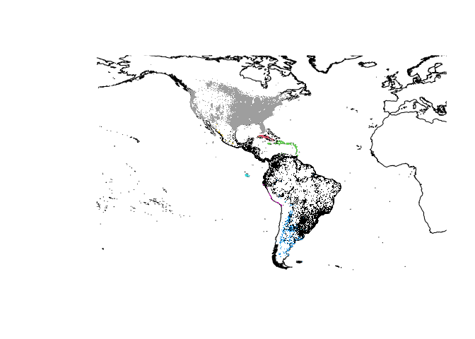<!-- -->

## Removing Outliers

We can look at these in a species-specific manner to remove vagrants and
potentially erroneous records.

``` r
# define function for plotting

species.list=unique(as.character(x$species))
species=species.list[1]
species_plotter=function(species){
  y=x[x$species==species,]
  plot(coastline,
       xlim=c(min(y$decimalLongitude),max(y$decimalLongitude)),
       ylim=c(min(y$decimalLatitude),max(y$decimalLatitude)),
       main=print(as.character(species)))
  points(y$decimalLongitude,y$decimalLatitude,pch=19)
  #y$countryCode=as.factor(y$countryCode)
  #return(as.matrix(table(y$countryCode)))
}
```

``` r
species.list=species.list[order(species.list)] # alphabetize
```

### Limit Dates

I am going to limit the dates to April-July and October-January for
largely migratory species. *Progne* are notorious for being early
migrants, and this will help capture the breeding and non-breeding
seasons, filtering out most migrants. The windows are wide because
nesting occurs at very variables times of year within related taxa; for
example, *P. s. subis* can lay eggs as early as March and as late as
August.

### Load rarefy

I’m loading a rarefy script that will also help with the models,
especially in areas with heavy data bias. (For example, *Progne subis*
are much more densely sampled in the Eastern United States than
essentially anywhere else). This will be done for a 20 km area for wide
ranging taxa, and 10 km for taxa that are limited to small areas
(specifically, *P. modesta* and *P. murphyi*.)

``` r
source(paste0(filepath,"Manthey_rarefy_2017_progne.R"))
```

``` r
rarefy_species=function(data,species,km){
  subset.data=data%>%
    filter(species==species)
  #print(paste0("Starting with ",nrow(subset.data)," points."))
  if(nrow(subset.data)<1){
    print("ERROR: check your spelling.")
    break}
  data=data%>%filter(species!=species)
  
  # run modified code
  subset.data=rarefy(input=subset.data,distance.km=km)
  #print(paste0("Ending with ",nrow(subset.data)," points."))
  data=rbind(data,subset.data)
  return(data)
}
```

``` r
# set as data frame
x=as.data.frame(x)
x$species=as.character(x$species)
```

### *Progne chalybea*

``` r
x=rarefy_species(data=x,
                 species=species.list[which(species.list%like%"chalybea")],
                 km=20)
```

    ## [1] "Starting with 238644 points."

This species is a local migrant in the north and apparently a locally
long-distance migrant in the south. Maintaining year-round records.

``` r
species_plotter(species.list[which(species.list%like%"chalybea")])
```

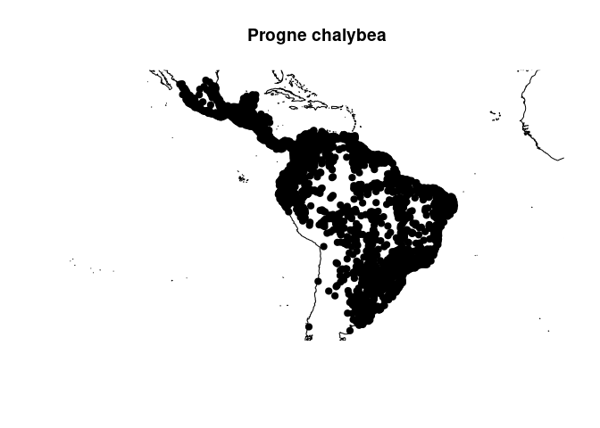<!-- -->

    ## [1] "Progne chalybea"

There are a few vagrant taxa for this species, from the United States,
Puerto Rico, and Chile.

``` r
# remove countries where species is vagrant
x=x[-which(x$species==
             species.list[which(species.list%like%"chalybea")]&
             x$countryCode=='CL'),] # Chile
#x=x[-which(x$species==
#             species.list[which(species.list%like%"chalybea")]&
#             x$countryCode=='US'),] # USA
#x=x[-which(x$species==
#             species.list[which(species.list%like%"chalybea")]&
#             x$countryCode=='PR'),] # Puerto Rico
#x=x[-which(x$species==
#             species.list[which(species.list%like%"chalybea")]&
#             x$countryCode=='AW'),] # Aruba
# some mislabeled to country, remove those over 26 N
#x=x[-which(x$species==
#             species.list[which(species.list%like%"chalybea")]&
#             x$decimalLatitude>26),]

# leaving two records in central Argentina; not far out of range
```

### *Progne cryptoleuca*

``` r
x=rarefy_species(data=x,
                 species="Progne cryptoleuca",
                 km=20)
```

    ## [1] "Starting with 11695 points."

Migrant, but all records being kept geographically are from breeding
range, so no time filter applied.

``` r
species_plotter(species.list[which(species.list%like%"cryptoleuca")])
```

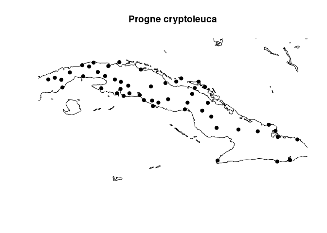<!-- -->

    ## [1] "Progne cryptoleuca"

Removing migrants, and note the lack of definitive winter records.

``` r
#x=x[-which(x$species==
#             species.list[which(species.list%like%"cryptoleuca")]&
#             x$countryCode!='CU'),] # Cuba only
```

### *Progne dominicensis*

``` r
x=rarefy_species(data=x,
                 species="Progne dominicensis",
                 km=20)
```

    ## [1] "Starting with 11695 points."

Like *P. cryptoleuca*, we are applying a geographic filter that only
keeps the breeding populations, and possibly a few migrants on the
island of Trinidad (species breeds on Tobago).

``` r
species_plotter(species.list[which(species.list%like%"dominicensis")])
```

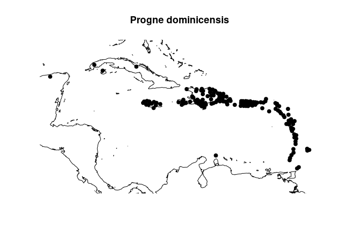<!-- -->

    ## [1] "Progne dominicensis"

``` r
x=x[-which(x$species==
             species.list[which(species.list%like%"dominicensis")]&
             x$countryCode=='CU'),] # Cuba
x=x[-which(x$species==
             species.list[which(species.list%like%"dominicensis")]&
             x$countryCode=='MX'),] # Mexico
#x=x[-which(x$species==
#             species.list[which(species.list%like%"dominicensis")]&
#             x$countryCode=='US'),] # United States
#x=x[-which(x$species==
#             species.list[which(species.list%like%"dominicensis")]&
#             x$countryCode=='BM'),] # Bermuda
#x=x[-which(x$species==
#             species.list[which(species.list%like%"dominicensis")]&
#             x$countryCode=='VE'),] # Venezuela
#x=x[-which(x$species==
#             species.list[which(species.list%like%"dominicensis")]&
#             x$countryCode=='TC'),] # Turks & Caicos
```

### *Progne elegans*

``` r
x=rarefy_species(data=x,
                 species="Progne elegans",
                 km=20)
```

    ## [1] "Starting with 11691 points."

Highly migratory, so applying a time filter here.

``` r
# time filter
p_elegans=x[which(x$species==
                    species.list[species.list%like%"elegans"]),]%>%
  filter(month!=2,month!=3,
         month!=8,month!=9)

x=x[-which(x$species==
             species.list[species.list%like%"elegans"]),]

x=rbind(x,p_elegans)
rm(p_elegans)

species_plotter(species.list[which(species.list%like%"elegans")])
```

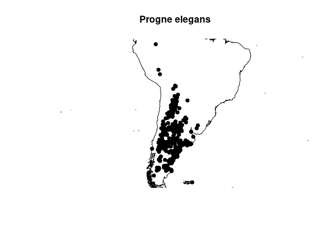<!-- -->

    ## [1] "Progne elegans"

Note this includes several winter records as well; leaving all Brazil
records.

``` r
#x=x[-which(x$species==
#             species.list[which(species.list%like%"elegans")]&
#             x$countryCode=='PA'),] # Panama
x=x[-which(x$species==
             species.list[which(species.list%like%"elegans")]&
             x$countryCode=='FK'),] # Falkland Islands
x=x[-which(x$species==
             species.list[which(species.list%like%"elegans")]&
             x$countryCode=='CL'),] # Chile
```

### *Progne modesta*

``` r
x=rarefy_species(data=x,
                 species="Progne modesta",
                 km=10)
```

    ## [1] "Starting with 11608 points."

Non-migratory.

``` r
species_plotter(species.list[which(species.list%like%"modesta")])
```

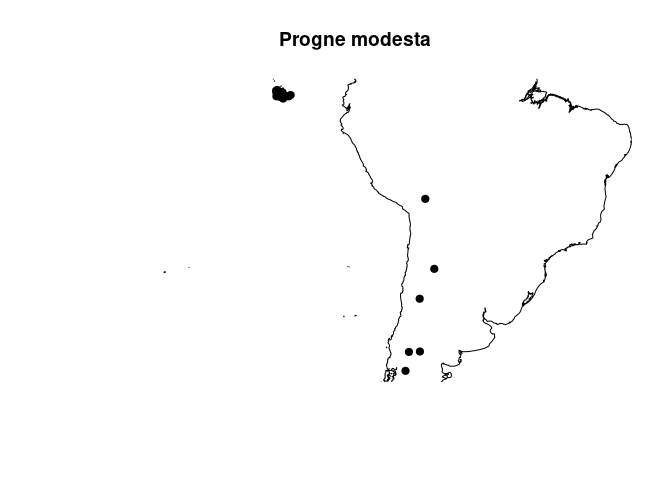<!-- -->

    ## [1] "Progne modesta"

Taxonomic issue; as presently defined, endemic to the Galapagos,
Ecuador.

``` r
x=x[-which(x$species==
             species.list[which(species.list%like%"modesta")]&
             x$countryCode!='EC'),] # United States
```

### *Progne murphyi*

``` r
x=rarefy_species(data=x,
                 species="Progne murphyi",
                 km=10)
```

    ## [1] "Starting with 11602 points."

Non-migratory.

``` r
species_plotter(species.list[which(species.list%like%"murphyi")])
```

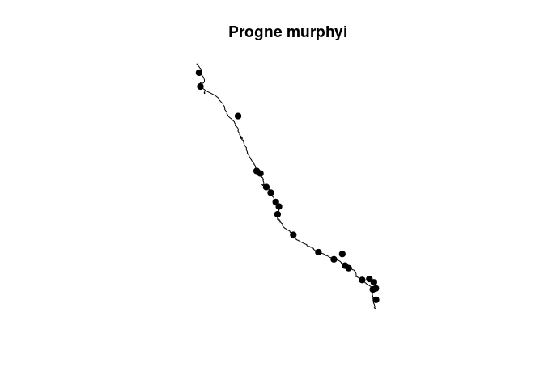<!-- -->

    ## [1] "Progne murphyi"

These records all appear correct.

### *Progne sinaloae*

``` r
# need over ten points; few species

x=rarefy_species(data=x,
                 species="Progne sinaloae",
                 km=10)
```

    ## [1] "Starting with 11602 points."

Migratory; applying time filter.

``` r
# time filter
p_sinaloae=x[which(x$species==
                    species.list[species.list%like%"sinaloae"]),]%>%
  filter(month!=2,month!=3,
         month!=8,month!=9)

x=x[-which(x$species==
             species.list[species.list%like%"sinaloae"]),]

x=rbind(x,p_sinaloae)

species_plotter(species.list[which(species.list%like%"sinaloae")])
```

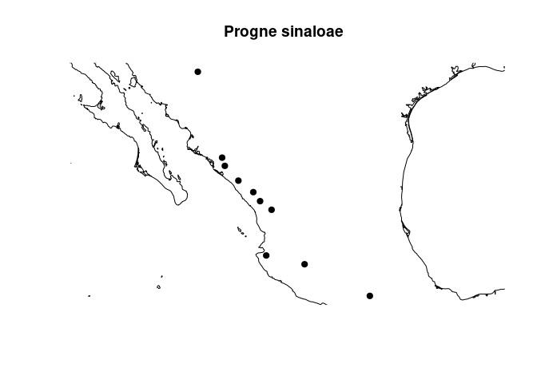<!-- -->

    ## [1] "Progne sinaloae"

There are some potential winter records in here as well, especially in
Jalisco. Removing all records from S of the Isthmus of Tehuantepec.

``` r
#x=x[-which(x$species==
#             species.list[which(species.list%like%"sinaloae")]&
#             x$decimalLongitude>-94.7),] # Longitude of Isthmus
```

### *Progne subis*

``` r
x=rarefy_species(data=x,
                 species="Progne subis",
                 km=20)
```

    ## [1] "Starting with 11596 points."

Highly migratory.

``` r
# time filter
p_subis=x[which(x$species==
                    species.list[species.list%like%"subis"]),]%>%
  filter(month!=2,month!=3,
         month!=8,month!=9,
         month!=10) # adding October for subis!

x=x[-which(x$species==
             species.list[species.list%like%"subis"]),]

x=rbind(x,p_subis)

species_plotter(species.list[which(species.list%like%"subis")])
```

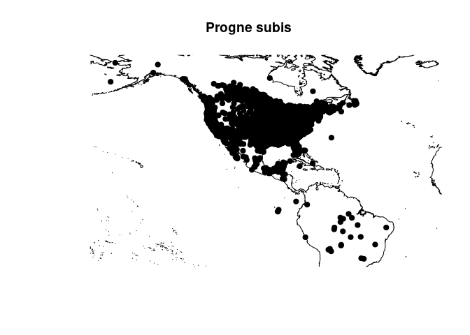<!-- -->

    ## [1] "Progne subis"

Perhaps unsurprisingly given the amount of effort in North America, this
species possesses the most records. We are removing known migrants and
vagrants. I can remove some countries here-and-now (especially
migrant-only and vagrant countries), but parsing into subspecies will
require more work. For example, furthest south breeding is Mexico and
furthest north wintering is Colombia, so I can remove Central American
and Caribbean points.

``` r
# easier to define countries to keep!
other_progne=x[
  which(x$species!=species.list[which(species.list%like%"subis")]),]
# breeding
CA=x[which(x$species==
             species.list[which(species.list%like%"subis")]&
             x$countryCode=='CA'),] # Canada
US=x[which(x$species==
             species.list[which(species.list%like%"subis")]&
             x$decimalLatitude<49.5& # exclude Alaska
             x$countryCode=='US'),] # United States
MX=x[which(x$species==
             species.list[which(species.list%like%"subis")]&
             x$countryCode=='MX'),] # Mexico

summer_subis=rbind(CA,US,MX)
rm(CA)
rm(US)
rm(MX)

# wintering
CO=x[which(x$species==
             species.list[which(species.list%like%"subis")]&
             x$decimalLongitude>c(-79.1)& # exclude Caribbean
             x$countryCode=='CO'),] # Colombia
VE=x[which(x$species==
             species.list[which(species.list%like%"subis")]&
             x$countryCode=='VE'),] # Venezuela
GY=x[which(x$species==
             species.list[which(species.list%like%"subis")]&
             x$countryCode=='GY'),] # Guyana
SR=x[which(x$species==
             species.list[which(species.list%like%"subis")]&
             x$countryCode=='SR'),] # Suriname
GF=x[which(x$species==
             species.list[which(species.list%like%"subis")]&
             x$countryCode=='GF'),] # French Guiana
BR=x[which(x$species==
             species.list[which(species.list%like%"subis")]&
             x$countryCode=='BR'),] # Brazil
EC=x[which(x$species==
             species.list[which(species.list%like%"subis")]&
             x$decimalLongitude>c(-81.2)& # exclude Galapagos
             x$countryCode=='EC'),] # Ecuador
PE=x[which(x$species==
             species.list[which(species.list%like%"subis")]&
             x$countryCode=='PE'),] # Peru
BO=x[which(x$species==
             species.list[which(species.list%like%"subis")]&
             x$countryCode=='BO'),] # Bolivia
PY=x[which(x$species==
             species.list[which(species.list%like%"subis")]&
             x$countryCode=='PY'),] # Paraguay
UY=x[which(x$species==
             species.list[which(species.list%like%"subis")]&
             x$countryCode=='UY'),] # Uruguay
AR=x[which(x$species==
             species.list[which(species.list%like%"subis")]&
             x$countryCode=='AR'),] # Argentina

all_subis=rbind(summer_subis,
                CO,VE,GY,SR,
                GF,BR,EC,PE,
                BO,PY,UY,AR)

rm(CO)
rm(VE)
rm(GY)
rm(SR)
rm(GF)
rm(BR)
rm(EC)
rm(PE)
rm(BO)
rm(PY)
rm(UY)
rm(AR)

# only bind summer records
x=rbind(summer_subis,other_progne)
rm(other_progne)
rm(all_subis)
```

### *Progne tapera*

``` r
x=rarefy_species(data=x,
                 species="Progne tapera",
                 km=20)
```

    ## [1] "Starting with 10046 points."

``` r
# time filter
p_tapera=x[which(x$species==
                    species.list[species.list%like%"tapera"]),]%>%
  filter(month!=2,month!=3,
         month!=4, # adding April for tapera!
         month!=8,month!=9)

x=x[-which(x$species==
             species.list[species.list%like%"tapera"]),]

x=rbind(x,p_tapera)

species_plotter(species.list[which(species.list%like%"tapera")])
```

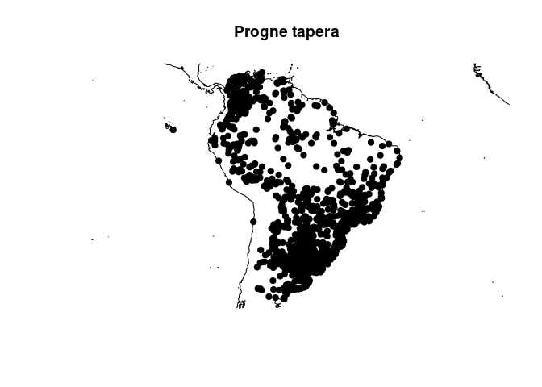<!-- -->

    ## [1] "Progne tapera"

For this one, we also need to remove vagrants from outside of the main
distribution, and then we need to define migratory and non migratory
populations.

``` r
x=x[-which(x$species==
             species.list[which(species.list%like%"tapera")]&
             x$decimalLongitude<c(-89)& # exclude Galapagos
             x$countryCode=='EC'),] # Ecuador
x=x[-which(x$species==
             species.list[which(species.list%like%"tapera")]&
             x$countryCode=='CL'),] # Chile
#x=x[-which(x$species==
#             species.list[which(species.list%like%"tapera")]&
#             x$countryCode=='CR'),] # Costa Rica
#x=x[-which(x$species==
#             species.list[which(species.list%like%"tapera")]&
#             x$decimalLatitude>12.4),] # North of SA
```

Save as a new file. Keep in mind offshore records etc. will be
automatically purged when pulling environmental data.

``` r
write_csv(x,file=paste0(filepath,"progne_filtered.csv"))
```

## Subspecies assignations

``` r
x=read_csv(paste0(filepath,"progne_filtered.csv"))
```

    ## Rows: 9498 Columns: 6
    ## ── Column specification ────────────────────────────────────────────────────────
    ## Delimiter: ","
    ## chr (3): species, infraspecificEpithet, countryCode
    ## dbl (3): decimalLongitude, decimalLatitude, month
    ## 
    ## ℹ Use `spec()` to retrieve the full column specification for this data.
    ## ℹ Specify the column types or set `show_col_types = FALSE` to quiet this message.

In order to assign tentative subspecies limits to populations of *P.
subis* and *P. tapera*, we will be using shapefiles defined by JCC based
on the literature and species’ ecology. **NOTE** that many birds in
Mexico and SW USA are considered unknown, given their complex taxonomic
status. Even the Birds of the World conflicts with itself regarding the
status of birds in the Chiricahuas, Arizona! Coastal *P. s. arboricola*
are separated from interior *arboricola* on basis of habitat and ecology
(interior west nest remotely in Aspen, coastal will nest on man made
structures and other locations).

``` r
shapefiles=list.files(filepath,pattern="*.gpkg")

shapefiles
```

    ##  [1] "progne_subis_arboricola.gpkg"        "progne_subis_hesperia.gpkg"         
    ##  [3] "progne_subis_subis.gpkg"             "progne_subis_unknown.gpkg"          
    ##  [5] "progne_subis_westcoast.gpkg"         "progne_tapera_fusca.gpkg"           
    ##  [7] "progne-chalybea_accessible.gpkg"     "progne-cryptoleuca_accessible.gpkg" 
    ##  [9] "progne-dominicensis_accessible.gpkg" "progne-elegans_accessible.gpkg"     
    ## [11] "progne-modesta_accessible.gpkg"      "progne-murphyi_accessible.gpkg"     
    ## [13] "progne-sinaloae_accessible.gpkg"     "progne-subis_accessible.gpkg"       
    ## [15] "progne-tapera_accessible.gpkg"

``` r
shapefiles=paste0(filepath,shapefiles)
```

``` r
# Progne subis subis

y=readOGR(shapefiles[shapefiles%like%'subis_subis'])
y@data[,]=1

x=read_csv(paste0(filepath,'progne_filtered.csv'))

# make all subis unknown
# correct for errors in databases in so doing

x$infraspecificEpithet[which(x$species=="Progne subis")]="Unknown"

x=x%>%
  dplyr::select(species,infraspecificEpithet,
         decimalLongitude,decimalLatitude)
x[is.na(x)]="Unknown"

xy=as.data.frame(x[,c("decimalLongitude","decimalLatitude")])

colnames(xy)=c("Long","Lat")
coordinates(xy)= ~ Long + Lat
crs(xy)=crs(y)

z=over(xy,y)

index.shp=which(z>0)
index.spp=which(x$species=="Progne subis"&
                  x$infraspecificEpithet=="Unknown")

index=index.shp[which(index.shp%in%index.spp)]

x$infraspecificEpithet[index]="subis"
```

``` r
# Progne subis arboricola

y=readOGR(shapefiles[shapefiles%like%'arboricola'])
y@data[,]=1

z=over(xy,y)

index.shp=which(z>0)
index.spp=which(x$species=="Progne subis"&
                  x$infraspecificEpithet=="Unknown")

index=index.shp[which(index.shp%in%index.spp)]

x$infraspecificEpithet[index]="arboricola"
```

``` r
# Progne subis hesperia

y=readOGR(shapefiles[shapefiles%like%'hesperia'])
y@data[,]=1

z=over(xy,y)

index.shp=which(z>0)
index.spp=which(x$species=="Progne subis"&
                  x$infraspecificEpithet=="Unknown")

index=index.shp[which(index.shp%in%index.spp)]

x$infraspecificEpithet[index]="hesperia"
```

``` r
# Progne subis (Mexican Pops)

y=readOGR(shapefiles[shapefiles%like%'unknown'])
y@data[,]=1

z=over(xy,y)

index.shp=which(z>0)
index.spp=which(x$species=="Progne subis"&
                  x$infraspecificEpithet=="Unknown")

index=index.shp[which(index.shp%in%index.spp)]

x$infraspecificEpithet[index]="enigmae"
```

``` r
# Progne subis arboricola (west coast)

y=readOGR(shapefiles[shapefiles%like%'westcoast'])
y@data[,]=1

z=over(xy,y)

index.shp=which(z>0)
index.spp=which(x$species=="Progne subis"&
                  x$infraspecificEpithet=="Unknown")

index=index.shp[which(index.shp%in%index.spp)]

x$infraspecificEpithet[index]="pacifica"
```

``` r
# Progne tapera fusca

y=readOGR(shapefiles[shapefiles%like%'fusca'])
y@data[,]=1

z=over(xy,y)

index.shp=which(z>0)
index.spp=which(x$species=="Progne tapera"&
                  x$infraspecificEpithet=="Unknown")

index=index.shp[which(index.shp%in%index.spp)]

x$infraspecificEpithet[index]="fusca"
```

``` r
write_csv(x,file=paste0(filepath,"progne_subspecies.csv"))
```

# Environmental Characters

``` r
x=read_csv(paste0(filepath,"progne_subspecies.csv"))
```

    ## Rows: 9498 Columns: 4
    ## ── Column specification ────────────────────────────────────────────────────────
    ## Delimiter: ","
    ## chr (2): species, infraspecificEpithet
    ## dbl (2): decimalLongitude, decimalLatitude
    ## 
    ## ℹ Use `spec()` to retrieve the full column specification for this data.
    ## ℹ Specify the column types or set `show_col_types = FALSE` to quiet this message.

``` r
plot(coastline,main="Species Map",
     xlim=c(min(x$decimalLongitude),max(x$decimalLongitude)),
     ylim=c(min(x$decimalLatitude),max(x$decimalLatitude)))
points(x$decimalLongitude,x$decimalLatitude,col=as.factor(x$species),pch=".")
```

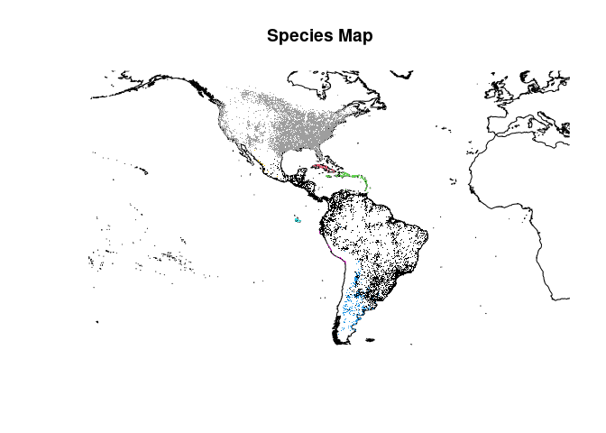<!-- -->

``` r
plot(coastline,main="Population Map",
     xlim=c(min(x$decimalLongitude),max(x$decimalLongitude)),
     ylim=c(min(x$decimalLatitude),max(x$decimalLatitude)))
points(x$decimalLongitude,x$decimalLatitude,col=as.factor(x$infraspecificEpithet),pch=".")
```

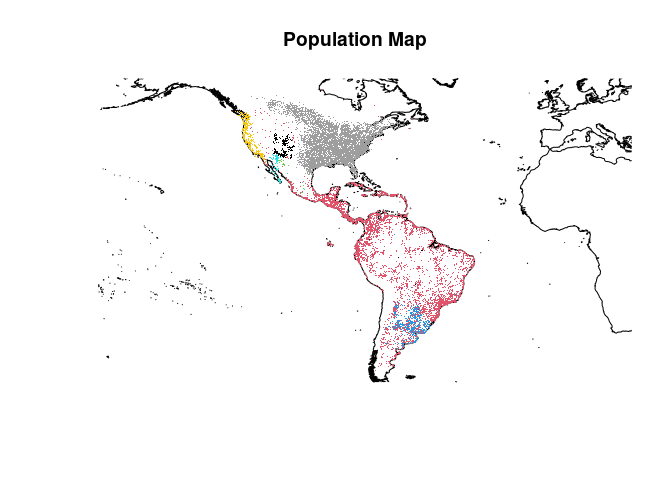<!-- -->

``` r
summary(as.factor(x$infraspecificEpithet))
```

    ##    arboricola      chalybea       enigmae         fusca      hesperia 
    ##           189            21            25           435            73 
    ## macrorhamphus      pacifica         subis        tapera       Unknown 
    ##             8           303          4396             5          4043

We are going to be using the ENVIREM dataset for our bioclimatic layers.
We have conditions for present day and for past climates.

``` r
r=raster(envirem_files[1])
plot(r)
```

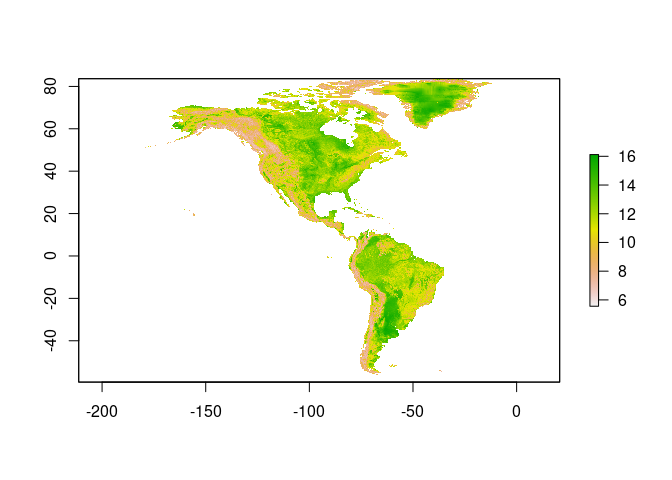<!-- -->

We have six folders of variables to loop through, all in the same main
directory. We need to extract the values from all of these for our
*Progne* data, but need to make sure everything is sufficiently labeled
to be easily interpretable for later analyses.

``` r
# write to operate on all files within a path

colnames(x)=c('Species','Subspecies','Long','Lat')

folder=envirem_path
file=x

data_extractor=function(file,folder){
  # get files
  # files are GEOTIFF in this study
  env_files=list.files(folder,pattern="*.tif")
  env_files=paste0(folder,env_files)
  
  for(i in 1:length(env_files)){
    y=raster(env_files[i])
    ext.dat=raster::extract(x=y, # raster
                            y=file[,c('Long','Lat')])
    n.c=ncol(file)
    file[,n.c+1]=ext.dat
    new_col=strsplit(env_files[i],"/")[[1]][length(strsplit(env_files[i],"/")[[1]])]
    new_col=strsplit(new_col,"[.]")[[1]][1]
    colnames(file)[n.c+1]=paste0(new_col)
  }
  return(file)
}
```

Given that my file paths reveal information about my computer, I am
running these privately.

Remove *P. subis* points that do not appear to belong to any population.

``` r
x=read_csv(paste0(filepath,'progne_env_extract.csv'))
plot(x$Long[which(x$Species=="Progne subis")],
     x$Lat[which(x$Species=="Progne subis")],
     asp=1,pch=19,col=as.factor(x$Subspecies))
index=which(x$Species=="Progne subis"&x$Subspecies=="Unknown")
x=x[-index,]
write_csv(x,paste0(filepath,'progne_env_extract.csv'))
```

## Analyzing Environmental Data

To get a sense of environmental variability, we are going to be doing a
principal components analysis.

``` r
x=read_csv(paste0(filepath,"progne_env_extract.csv"))
```

    ## Rows: 9408 Columns: 22
    ## ── Column specification ────────────────────────────────────────────────────────
    ## Delimiter: ","
    ## chr  (2): Species, Subspecies
    ## dbl (20): Long, Lat, current_2-5arcmin_topoWet, current_2-5arcmin_tri, curre...
    ## 
    ## ℹ Use `spec()` to retrieve the full column specification for this data.
    ## ℹ Specify the column types or set `show_col_types = FALSE` to quiet this message.

``` r
x=na.omit(x) # remove rows with missing values

env_current=x[,which(colnames(x)%like%'current_')]

env_current=env_current%>%
  dplyr::select(-`current_2-5arcmin_tri`,
                -`current_2-5arcmin_growingDegDays0`,
                -`current_2-5arcmin_growingDegDays5`,
                -`current_2-5arcmin_monthCountByTemp10`)

env_rda=rda(env_current)

x_rda=as.data.frame(cbind(x,env_rda$CA$u))
x_rda$Species=as.factor(x_rda$Species)
x_rda$Subspecies=as.factor(x_rda$Subspecies)
```

``` r
ggplot(x_rda,aes(x=PC1,y=PC2,color=Species))+
  geom_point(size=0.25)+
  theme_classic()
```

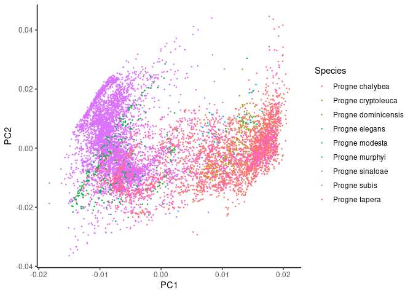<!-- -->

Following code from a (helpful StackOverflow
page)\[<https://stackoverflow.com/questions/50177409/how-to-calculate-species-contribution-percentages-for-vegan-rda-cca-objects>.
Note that this only allows us to see the scores from the first two
principal components.

``` r
#PC1
head(sort(round(100*scores(env_rda,display="sp",scaling=0)[,1]^2,3),decreasing=T))
```

    ##    current_2-5arcmin_PETseasonality         current_2-5arcmin_annualPET 
    ##                              96.292                               1.193 
    ##   current_2-5arcmin_thermicityIndex         current_2-5arcmin_embergerQ 
    ##                               1.149                               0.963 
    ##    current_2-5arcmin_maxTempColdest current_2-5arcmin_PETColdestQuarter 
    ##                               0.318                               0.041

``` r
#PC2
head(sort(round(100*scores(env_rda,display="sp",scaling=0)[,2]^2,3),decreasing=T))
```

    ##       current_2-5arcmin_annualPET current_2-5arcmin_thermicityIndex 
    ##                            70.058                            18.679 
    ##  current_2-5arcmin_maxTempColdest  current_2-5arcmin_PETseasonality 
    ##                             5.723                             2.199 
    ##       current_2-5arcmin_embergerQ  current_2-5arcmin_minTempWarmest 
    ##                             0.824                             0.814

As we can see, seasonality explains a lot of the variability within this
dataset. This makes a lot of sense, given that many species are
non-migratory and occur within tropical regions. However, the temperate
species are migratory, so we need to look predominately at variables
associated with breeding conditions:

``` r
env_current2=x[,which(colnames(x)%like%'current_')]

env_current2=env_current2%>%
  dplyr::select(-`current_2-5arcmin_tri`,
                -`current_2-5arcmin_growingDegDays0`,
                -`current_2-5arcmin_growingDegDays5`,
                -`current_2-5arcmin_monthCountByTemp10`,
                ############################
                # Remove, relates winter to summer
                -`current_2-5arcmin_continentality`,
                # Remove, winter data will skew in temperate
                -`current_2-5arcmin_maxTempColdest`,
                # Remove, winter evapotranspiration
                -`current_2-5arcmin_PETColdestQuarter`,
                # Remove, condenses year round conditions
                -`current_2-5arcmin_thermicityIndex`,
                #Remove - seasonal variation
                -`current_2-5arcmin_PETseasonality`)

env_rda2=rda(env_current2)

x_rda2=as.data.frame(cbind(x,env_rda2$CA$u))
x_rda2$Species=as.factor(x_rda2$Species)
x_rda2$Subspecies=as.factor(x_rda2$Subspecies)
```

``` r
ggplot(x_rda2,aes(x=PC1,y=PC2,color=Species))+
  geom_point(size=0.25)+
  theme_classic()
```

<!-- -->

``` r
#PC1
head(sort(round(100*scores(env_rda2,display="sp",scaling=0)[,1]^2,3),decreasing=T))
```

    ##         current_2-5arcmin_annualPET         current_2-5arcmin_embergerQ 
    ##                              70.269                              27.776 
    ##  current_2-5arcmin_PETDriestQuarter    current_2-5arcmin_minTempWarmest 
    ##                               1.218                               0.681 
    ## current_2-5arcmin_PETWettestQuarter current_2-5arcmin_PETWarmestQuarter 
    ##                               0.046                               0.007

``` r
head(sort(round(100*scores(env_rda2,display="sp",scaling=0)[,2]^2,3),decreasing=T))
```

    ##                current_2-5arcmin_embergerQ 
    ##                                     71.452 
    ##                current_2-5arcmin_annualPET 
    ##                                     27.316 
    ##        current_2-5arcmin_PETWarmestQuarter 
    ##                                      0.461 
    ##        current_2-5arcmin_PETWettestQuarter 
    ##                                      0.416 
    ## current_2-5arcmin_aridityIndexThornthwaite 
    ##                                      0.182 
    ##           current_2-5arcmin_minTempWarmest 
    ##                                      0.133

Now that we have removed the seasonal variation, *Progne subis* appears
to be an outlier. We find that the above variables are most important
within the dataset for describing variation within *Progne* as a whole.

At first glance, I assume this refers to desert martins; the two biggest
outliers from a South American perspective are *Progne modesta* and
*Progne murphyi* (two arid country martins), and in North America a
large outlier is *Progne subis hesperia*, a population that specializes
in nesting in columnar cacti.

``` r
x_rda3=x_rda2%>%
  filter(Subspecies!="Unknown")%>%
  filter(Species=="Progne subis")

ggplot(x_rda3,aes(x=PC1,y=PC2,color=Subspecies))+
  geom_point(size=0.5)+
  theme_classic()
```

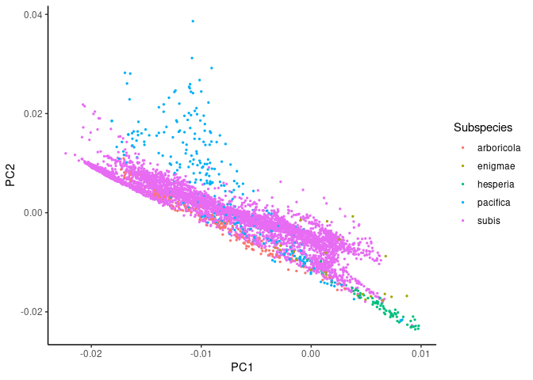<!-- -->

The large cloud of points corresponds to a lot of tropical martins; we
can now see that the *Progne subis* of the northwest are a fairly large
outlier. These birds appear to be outliers not for the arid reasons we
anticipated, but because of the moisture conditions of the northwestern
and northeastern parts of North America.

Just to be sure, we can compare everything variable-wise to see how
things compare.

``` r
# get variables

x.pairwise=x%>%
  dplyr::select(-Species,-Subspecies,
                -Long,-Lat)

# redefine species field for easier comparisons

spp=paste(x$Species,x$Subspecies)

spp2=gsub(" Unknown","",spp)

x.pairwise$Species=spp2

x.pairwise$Species=as.factor(x.pairwise$Species)
```

Now, to perform comparisons.

``` r
# note species is now the last column

i=1

for(i in 1:(ncol(x.pairwise)-1)){
  var=as.data.frame(x.pairwise[,c(i,ncol(x.pairwise))])
  print(ggplot(var,mapping=aes(x=Species,y=var[,1]))+
    geom_boxplot()+coord_flip()+theme_classic()+
    ylab(colnames(var)[1]))
}
```

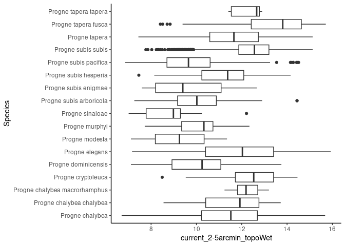<!-- -->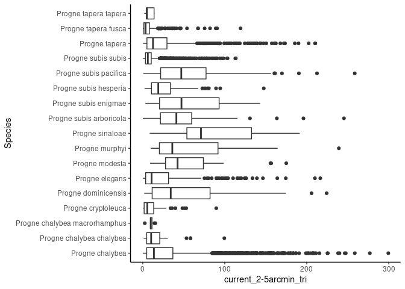<!-- -->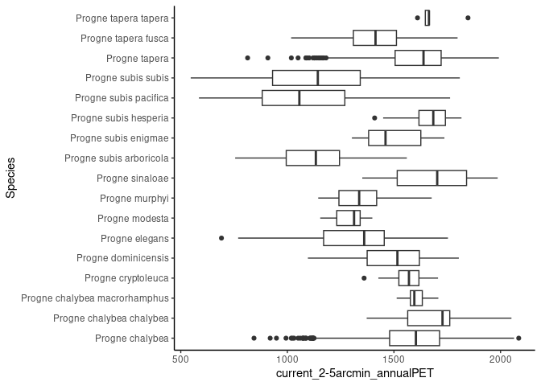<!-- -->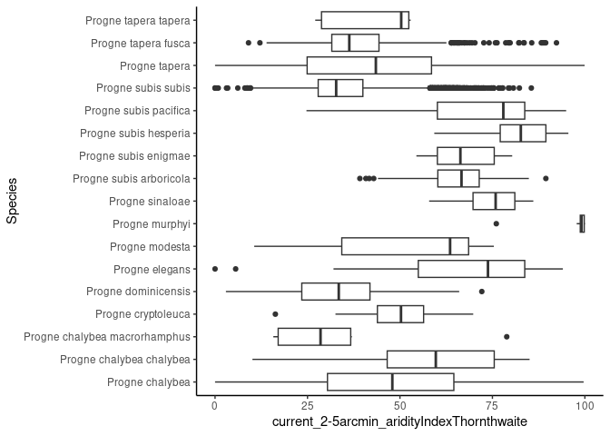<!-- -->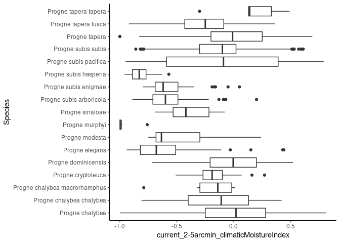<!-- -->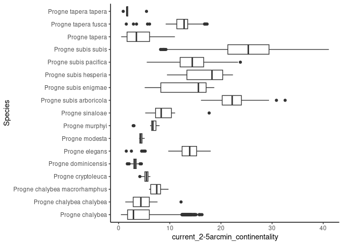<!-- -->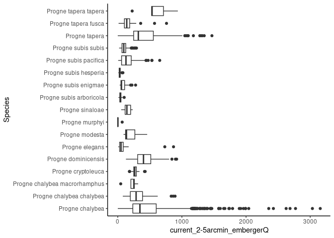<!-- -->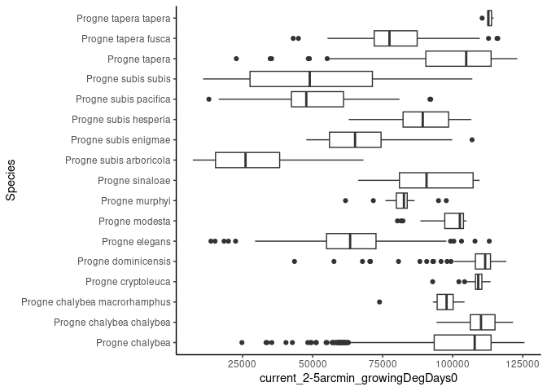<!-- -->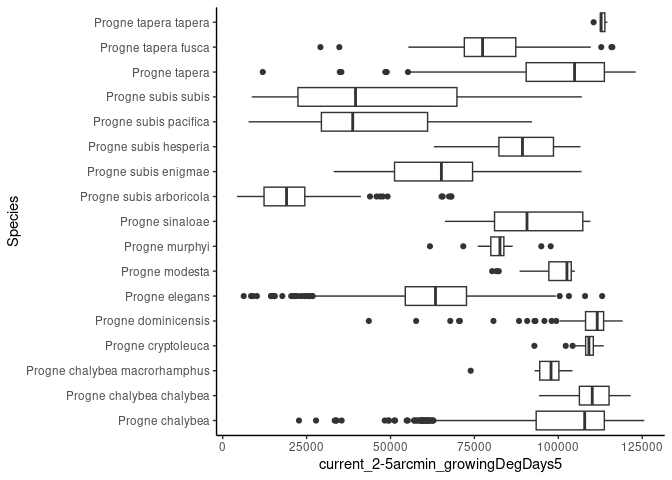<!-- -->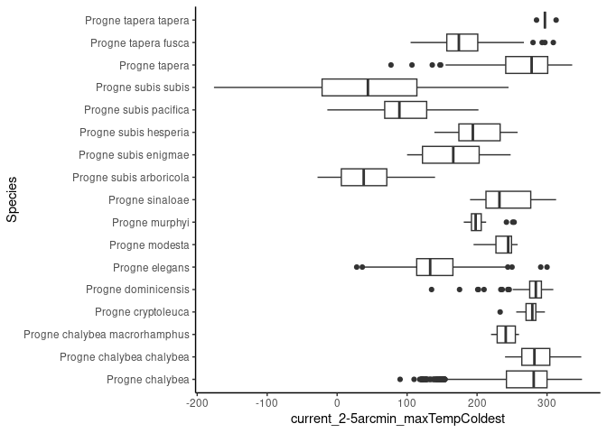<!-- -->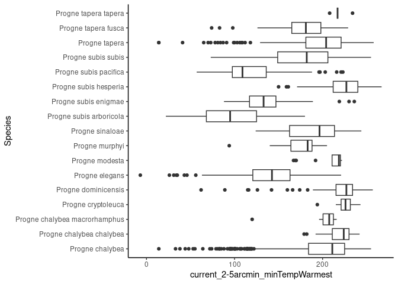<!-- -->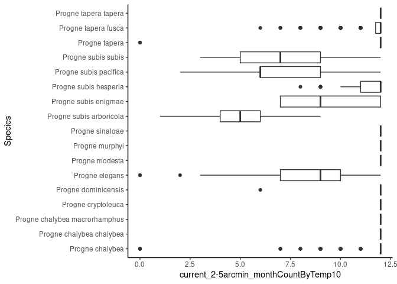<!-- -->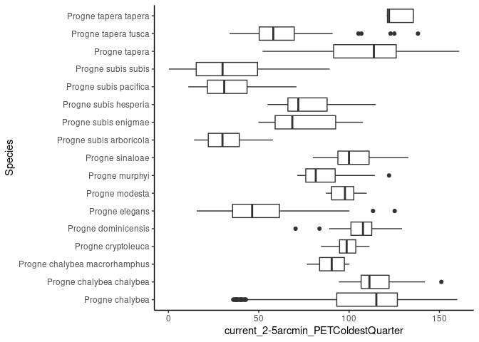<!-- -->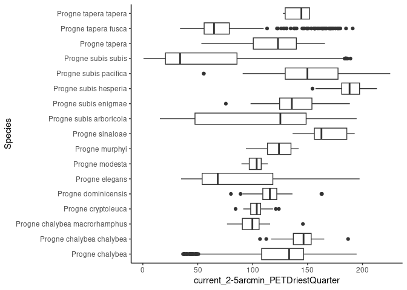<!-- -->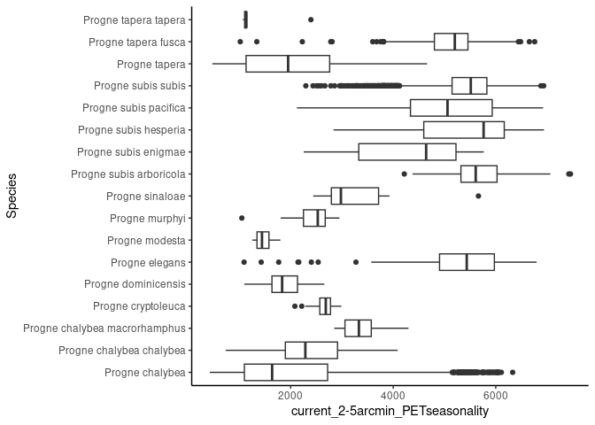<!-- -->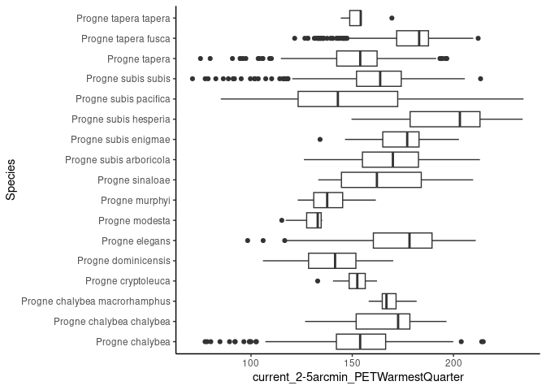<!-- -->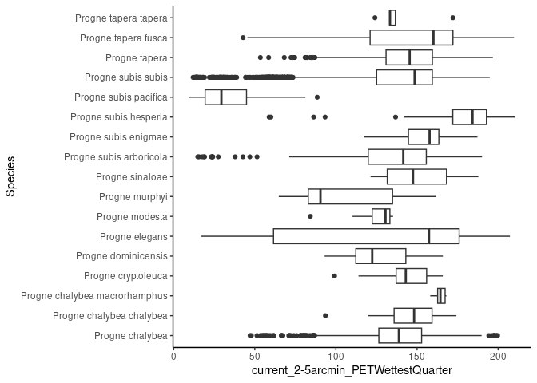<!-- -->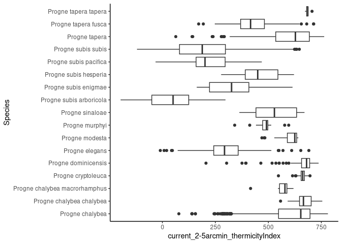<!-- -->

In line with the variables removed, we find:

1.  Migratory taxa in temperate regions have much higher continentality
    values, suggesting this is related to year-round variability in
    their ranges and not necessarily to conditions they are exposed to.
2.  Max temp of the coldest month is also lowest for migratory taxa,
    suggesting that the conditions when species are not present are
    skewing the data.
3.  PETSeasonality is likewise highest for migratory taxa in the north
    and south.

# Are *Progne* differentiating environmentally?

## Statistical tests of differentiation

We are going to try to correctly classify *Progne* environmentally using
discriminant function analyses. These analyses will operate on the
non-winter sensitive environmental characters.

``` r
# non winter sensitive environmental characters

lda_dat=x%>%
  dplyr::select(-Long,-Lat,-Subspecies,
                -`current_2-5arcmin_tri`,
                -`current_2-5arcmin_growingDegDays0`,
                -`current_2-5arcmin_growingDegDays5`,
                -`current_2-5arcmin_monthCountByTemp10`,
                ############################
                # Remove, relates winter to summer
                -`current_2-5arcmin_continentality`,
                # Remove, winter data will skew in temperate
                -`current_2-5arcmin_maxTempColdest`,
                # Remove, winter evapotranspiration
                -`current_2-5arcmin_PETColdestQuarter`,
                # Remove, condenses year round conditions
                -`current_2-5arcmin_thermicityIndex`,
                #Remove - seasonal variation
                -`current_2-5arcmin_PETseasonality`)
```

``` r
# performing on non-corrected variables
lda.x=lda(Species~.,data=lda_dat,CV=T)

# check predictions
ct=table(lda_dat$Species,lda.x$class)
print(ct)
```

    ##                      
    ##                       Progne chalybea Progne cryptoleuca Progne dominicensis
    ##   Progne chalybea                2078                  4                  62
    ##   Progne cryptoleuca               44                  0                   3
    ##   Progne dominicensis              78                  0                  37
    ##   Progne elegans                   29                  0                   0
    ##   Progne modesta                    0                  0                   4
    ##   Progne murphyi                    2                  0                   0
    ##   Progne sinaloae                   8                  0                   0
    ##   Progne subis                     73                  1                   3
    ##   Progne tapera                   583                  0                  17
    ##                      
    ##                       Progne elegans Progne modesta Progne murphyi
    ##   Progne chalybea                  8             10             42
    ##   Progne cryptoleuca               0              0              0
    ##   Progne dominicensis              0             11              0
    ##   Progne elegans                 166              0              0
    ##   Progne modesta                   0             12              0
    ##   Progne murphyi                   0              0             19
    ##   Progne sinaloae                  0              0              0
    ##   Progne subis                   162              4             11
    ##   Progne tapera                   36              1              2
    ##                      
    ##                       Progne sinaloae Progne subis Progne tapera
    ##   Progne chalybea                   0          173           301
    ##   Progne cryptoleuca                0            0             0
    ##   Progne dominicensis               0            0             0
    ##   Progne elegans                    0           85            36
    ##   Progne modesta                    0            0             0
    ##   Progne murphyi                    0            0             0
    ##   Progne sinaloae                   1            1             0
    ##   Progne subis                      9         4633            33
    ##   Progne tapera                     0          243           255

We can also view this as percents correct to make it more intuitive.

``` r
print(round(ct/rowSums(ct),2))
```

    ##                      
    ##                       Progne chalybea Progne cryptoleuca Progne dominicensis
    ##   Progne chalybea                0.78               0.00                0.02
    ##   Progne cryptoleuca             0.94               0.00                0.06
    ##   Progne dominicensis            0.62               0.00                0.29
    ##   Progne elegans                 0.09               0.00                0.00
    ##   Progne modesta                 0.00               0.00                0.25
    ##   Progne murphyi                 0.10               0.00                0.00
    ##   Progne sinaloae                0.80               0.00                0.00
    ##   Progne subis                   0.01               0.00                0.00
    ##   Progne tapera                  0.51               0.00                0.01
    ##                      
    ##                       Progne elegans Progne modesta Progne murphyi
    ##   Progne chalybea               0.00           0.00           0.02
    ##   Progne cryptoleuca            0.00           0.00           0.00
    ##   Progne dominicensis           0.00           0.09           0.00
    ##   Progne elegans                0.53           0.00           0.00
    ##   Progne modesta                0.00           0.75           0.00
    ##   Progne murphyi                0.00           0.00           0.90
    ##   Progne sinaloae               0.00           0.00           0.00
    ##   Progne subis                  0.03           0.00           0.00
    ##   Progne tapera                 0.03           0.00           0.00
    ##                      
    ##                       Progne sinaloae Progne subis Progne tapera
    ##   Progne chalybea                0.00         0.06          0.11
    ##   Progne cryptoleuca             0.00         0.00          0.00
    ##   Progne dominicensis            0.00         0.00          0.00
    ##   Progne elegans                 0.00         0.27          0.11
    ##   Progne modesta                 0.00         0.00          0.00
    ##   Progne murphyi                 0.00         0.00          0.00
    ##   Progne sinaloae                0.10         0.10          0.00
    ##   Progne subis                   0.00         0.94          0.01
    ##   Progne tapera                  0.00         0.21          0.22

We find that a lot of species are actually very similar with respect to
their environmental conditions, leading to a lot of confusion within the
test. For example, *P. chalybea* is often confused with *P. subis* and
*P. tapera*. Some of these interactions make clear sense
biogeographically - such as *P. cryptoleuca* and *P. dominicensis*. Many
of these also correspond to species with broadly overlapping ranges -
such as *P. elegans* and *P. tapera*. The only taxa recovered as
‘identifiable’ with over 90% success are *P. murphyi* and *P. subis*. We
can dive a bit deeper into *P. subis*.

``` r
subis=x%>%
  filter(Species=="Progne subis")%>%
  filter(Subspecies!="Unknown")%>%
  dplyr::select(-Long,-Lat,-Species,
                -`current_2-5arcmin_tri`,
                -`current_2-5arcmin_growingDegDays0`,
                -`current_2-5arcmin_growingDegDays5`,
                -`current_2-5arcmin_monthCountByTemp10`,
                ############################
                # Remove, relates winter to summer
                -`current_2-5arcmin_continentality`,
                # Remove, winter data will skew in temperate
                -`current_2-5arcmin_maxTempColdest`,
                # Remove, winter evapotranspiration
                -`current_2-5arcmin_PETColdestQuarter`,
                # Remove, condenses year round conditions
                -`current_2-5arcmin_thermicityIndex`,
                #Remove - seasonal variation
                -`current_2-5arcmin_PETseasonality`)
```

``` r
# performing on non-corrected variables
lda.x=lda(Subspecies~.,data=subis,CV=T)

# check predictions
ct=table(subis$Subspecies,lda.x$class)
print(ct)
```

    ##             
    ##              arboricola enigmae hesperia pacifica subis
    ##   arboricola        175       0        2        1    11
    ##   enigmae             8      10        3        2     2
    ##   hesperia            3       3       62        1     0
    ##   pacifica           35       6       11      243     0
    ##   subis               2       1        3        0  4345

``` r
print(round(ct/rowSums(ct),2))
```

    ##             
    ##              arboricola enigmae hesperia pacifica subis
    ##   arboricola       0.93    0.00     0.01     0.01  0.06
    ##   enigmae          0.32    0.40     0.12     0.08  0.08
    ##   hesperia         0.04    0.04     0.90     0.01  0.00
    ##   pacifica         0.12    0.02     0.04     0.82  0.00
    ##   subis            0.00    0.00     0.00     0.00  1.00

Within *P. subis*, we find that we are able to very effectively
differentiate between all populations in the United States. Mexican
birds, whose subspecific status is unclear, interestingly group fairly
even across their own group, *P. hesperia*, and *P. arboricola*. Few are
more similar to Pacific coast birds and fewer still are groups with the
eastern nominate population. The strengest support was recovered for *P.
s. subis*, with 100% of individuals being correctly assigned within
their group. All other populations (except aforemention Mexican birds)
are recovered with over 90% accuracy.

Let’s compare this to a classic taxonomic approach of considering only
three subspecies, with Mexican birds being grouped with eastern *P. s.
subis*, as is noted in Birds of the World.

``` r
subis$Subspecies=gsub("enigmae","subis",subis$Subspecies)
subis$Subspecies=gsub("pacifica","arboricola",subis$Subspecies)
```

``` r
# performing on non-corrected variables
lda.x=lda(Subspecies~.,data=subis,CV=T)

# check predictions
ct=table(subis$Subspecies,lda.x$class)
print(round(ct/rowSums(ct),2))
```

    ##             
    ##              arboricola hesperia subis
    ##   arboricola       0.96     0.02  0.01
    ##   hesperia         0.04     0.96  0.00
    ##   subis            0.00     0.00  0.99

We find extremely high support for these groups, and still find 100%
support for *P. s. subis* even with the group expanded!

### Human-based designations vs. machine-based designations

Firstly, we can compare how species-level designations compare to the
partitioning of the environmental data.

``` r
# about half the rows are P subis
lda_dat2=lda_dat%>%
  dplyr::select(-Species)

fviz_nbclust(lda_dat2,
             kmeans, # perform kmeans
             nstart=2,
             method="gap_stat", # gap statistics
             nboot=10,k.max=30)
```

    ## Warning: Quick-TRANSfer stage steps exceeded maximum (= 464000)

    ## Warning: did not converge in 10 iterations

    ## Warning: did not converge in 10 iterations

    ## Warning: did not converge in 10 iterations

    ## Warning: did not converge in 10 iterations

    ## Warning: did not converge in 10 iterations

    ## Warning: did not converge in 10 iterations

    ## Warning: did not converge in 10 iterations

    ## Warning: did not converge in 10 iterations

    ## Warning: did not converge in 10 iterations

    ## Warning: did not converge in 10 iterations

    ## Warning: did not converge in 10 iterations

    ## Warning: did not converge in 10 iterations

    ## Warning: did not converge in 10 iterations

    ## Warning: did not converge in 10 iterations

    ## Warning: did not converge in 10 iterations

    ## Warning: did not converge in 10 iterations

    ## Warning: did not converge in 10 iterations

    ## Warning: did not converge in 10 iterations

    ## Warning: did not converge in 10 iterations

    ## Warning: did not converge in 10 iterations

    ## Warning: did not converge in 10 iterations

    ## Warning: did not converge in 10 iterations

    ## Warning: did not converge in 10 iterations

    ## Warning: did not converge in 10 iterations

    ## Warning: did not converge in 10 iterations

    ## Warning: did not converge in 10 iterations

    ## Warning: did not converge in 10 iterations

    ## Warning: did not converge in 10 iterations

    ## Warning: did not converge in 10 iterations

    ## Warning: did not converge in 10 iterations

    ## Warning: did not converge in 10 iterations

    ## Warning: did not converge in 10 iterations

    ## Warning: did not converge in 10 iterations

    ## Warning: did not converge in 10 iterations

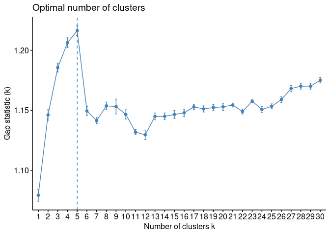<!-- -->

Using these data, we find a classification scheme for five populations,
as follows:

``` r
k5=kmeans(lda_dat2,5)
progne_clust=as.data.frame(cbind(lda_dat$Species,k5$cluster))

# check predictions
ct=table(progne_clust$V1,progne_clust$V2)
print(ct)
```

    ##                      
    ##                          1    2    3    4    5
    ##   Progne chalybea      618 1171  144    3  742
    ##   Progne cryptoleuca    21   26    0    0    0
    ##   Progne dominicensis   22   64    8    0   32
    ##   Progne elegans       162    9  102   41    2
    ##   Progne modesta         8    0    8    0    0
    ##   Progne murphyi        11    0   10    0    0
    ##   Progne sinaloae        5    5    0    0    0
    ##   Progne subis        1397   57 1736 1739    0
    ##   Progne tapera        447  365  152    2  171

Using the default *k*-means clustering in *R*, we recover the following
breakdown of taxa. Notable, most taxa appear to be split between
multiple groups, especially the wide ranging taxa. No single species is
grouped into a single ecolospecies, suggesting that there is a lot of
ecological overlap between taxa.

### *Progne subis*

We can compare these taxonomic designations to the ideal designations,
as determined mechanistically by a computer. Note that this is just for
the populations of *P. subis*, given that this is the most
environmentally varied, and a species of particular interest.

``` r
subis=x%>%
  filter(Species=="Progne subis")%>%
  filter(Subspecies!="Unknown")%>%
  dplyr::select(-Species,
                -`current_2-5arcmin_tri`,
                -`current_2-5arcmin_growingDegDays0`,
                -`current_2-5arcmin_growingDegDays5`,
                -`current_2-5arcmin_monthCountByTemp10`,
                ############################
                # Remove, relates winter to summer
                -`current_2-5arcmin_continentality`,
                # Remove, winter data will skew in temperate
                -`current_2-5arcmin_maxTempColdest`,
                # Remove, winter evapotranspiration
                -`current_2-5arcmin_PETColdestQuarter`,
                # Remove, condenses year round conditions
                -`current_2-5arcmin_thermicityIndex`,
                #Remove - seasonal variation
                -`current_2-5arcmin_PETseasonality`)%>%
  unique() # just in case
```

``` r
set.seed(123)

# sample down to make possible
# only applicable to subis; fewer records for others
summary(as.factor(subis$Subspecies))
```

    ## arboricola    enigmae   hesperia   pacifica      subis 
    ##        189         25         69        295       4351

``` r
subis.squared=subis%>%
  filter(Subspecies=="subis")
subis=subis%>%
  filter(Subspecies!="subis")
```

``` r
summary(as.factor(subis$Subspecies))
```

    ## arboricola    enigmae   hesperia   pacifica 
    ##        189         25         69        295

To help balance this out, we are going to do subsamples of 300 subis to
represent them.

``` r
index=sample(1:nrow(subis.squared),
             size=300,replace=F)

subis2=rbind(subis,subis.squared[index,])

progne.k=subis2%>%
  dplyr::select(-Long,-Lat,-Subspecies)%>%
  scale()

fviz_nbclust(progne.k,
             kmeans, # perform kmeans
             nstart=2,
             method="gap_stat", # gap statistics
             nboot=10,k.max=30)
```

    ## Warning: did not converge in 10 iterations

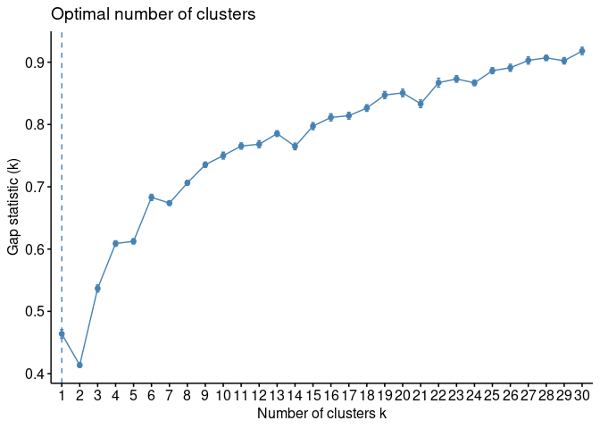<!-- --> With
no subsampling, we get one group for all. Surprising.

I performed five iterations with different samples. Note that a full run
with winter records resulted in 19 recommended groups! I was unable to
run it on the full dataset again, due to space issues (not sure why it
ran the first time).

After removing outliers and after thinning, we get only one group, which
seems odd. We can remove *subis*, the most environmentally broad taxa,
and compare again:

``` r
subis3=subis2%>%
  filter(Subspecies!="subis")

progne.k=subis3%>%
  dplyr::select(-Long,-Lat,-Subspecies)%>%
  scale()

fviz_nbclust(progne.k,
             kmeans, # perform kmeans
             nstart=2,
             method="gap_stat", # gap statistics
             nboot=10,k.max=30)
```

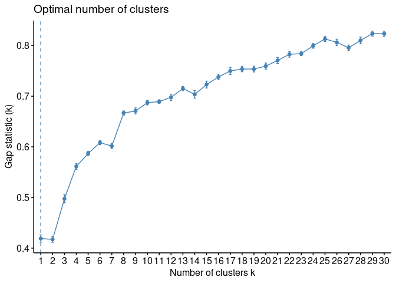<!-- -->

Still getting one group, which is surprising.

Before removing outliers in *P. subis*:

1.  6 groups
2.  19 groups
3.  19 groups
4.  6 groups
5.  19 groups

After removing outliers in *P. subis*, before thinning, with subsamples
of 10k *subis*:

1.  13 groups
2.  13 groups
3.  13 groups
4.  13 groups
5.  13 groups

So there’s a weird dichotomy in these data with the outliers, but we
converge on 13 without them.

``` r
# visualize data
coastline=readOGR(paste0(filepath,
                         "ne_10m_coastline/ne_10m_coastline.shp"))
```

    ## Warning: OGR support is provided by the sf and terra packages among others

    ## Warning: OGR support is provided by the sf and terra packages among others

    ## Warning: OGR support is provided by the sf and terra packages among others

    ## Warning: OGR support is provided by the sf and terra packages among others

    ## Warning: OGR support is provided by the sf and terra packages among others

    ## Warning: OGR support is provided by the sf and terra packages among others

    ## Warning: OGR support is provided by the sf and terra packages among others

    ## OGR data source with driver: ESRI Shapefile 
    ## Source: "/home/jccooper/Dropbox/Manuscripts/Progne/ne_10m_coastline/ne_10m_coastline.shp", layer: "ne_10m_coastline"
    ## with 4133 features
    ## It has 3 fields
    ## Integer64 fields read as strings:  scalerank

``` r
subis2=rbind(subis,subis.squared)

progne.k=subis2%>%
  dplyr::select(-Long,-Lat,-Subspecies)%>%
  scale()

x.k=kmeans(as.matrix(progne.k),13)

subis2$Cluster=x.k$cluster

plot(coastline,
     xlim=c(min(subis2$Long),max(subis2$Long)),
     ylim=c(min(subis2$Lat),max(subis2$Lat)),
     main="k = 13")
points(subis2$Long,subis2$Lat,
     col=subis2$Cluster,pch=".")
```

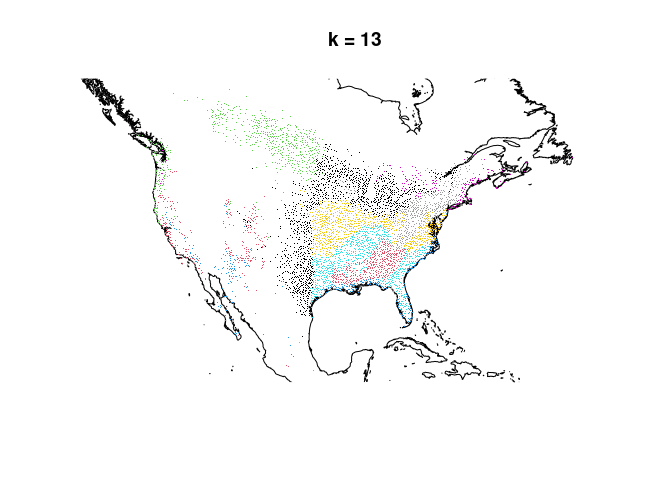<!-- -->

19 groups makes no sense from a biogeographic perspective, but it does
correspond to many unique environments within the region. We can also
look at how a k-means cluster would assess the same groups with respect
to the number of subspecies.

``` r
x.k=kmeans(as.matrix(progne.k),3)

subis2$Cluster=x.k$cluster

plot(coastline,
     xlim=c(min(subis2$Long),max(subis2$Long)),
     ylim=c(min(subis2$Lat),max(subis2$Lat)),
     main="k = 3")
points(subis2$Long,subis2$Lat,
     col=subis2$Cluster,pch=".")
```

<!-- -->

We can also assess this based on the number of populations I defined
based on environment / habit.

``` r
x.k=kmeans(as.matrix(progne.k),6)

subis2$Cluster=x.k$cluster

plot(coastline,
     xlim=c(min(subis2$Long),max(subis2$Long)),
     ylim=c(min(subis2$Lat),max(subis2$Lat)),
     main="k = 6")
points(subis2$Long,subis2$Lat,
     col=subis2$Cluster,pch=".")
```

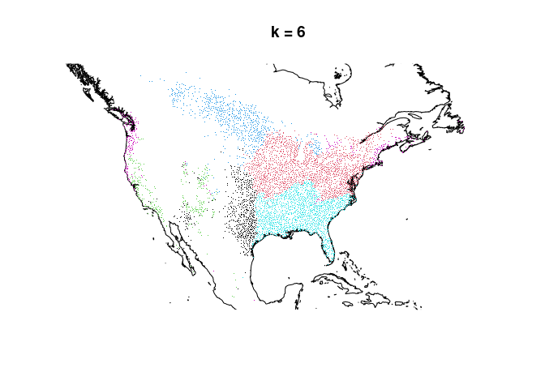<!-- -->

We still don’t get the reconstruction of the groups from before, even
though performing discriminant function analyses reconstructs the groups
well. This seems to be related to the sheer number of environments
encompassed by eastern birds.
